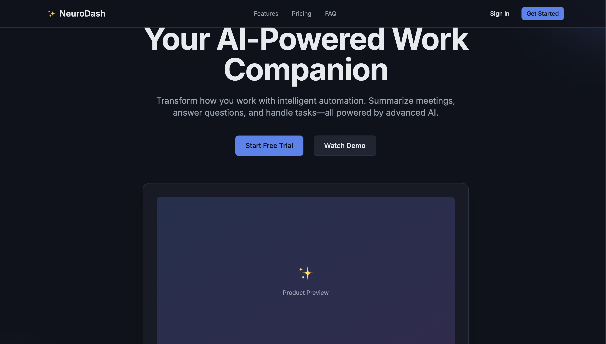
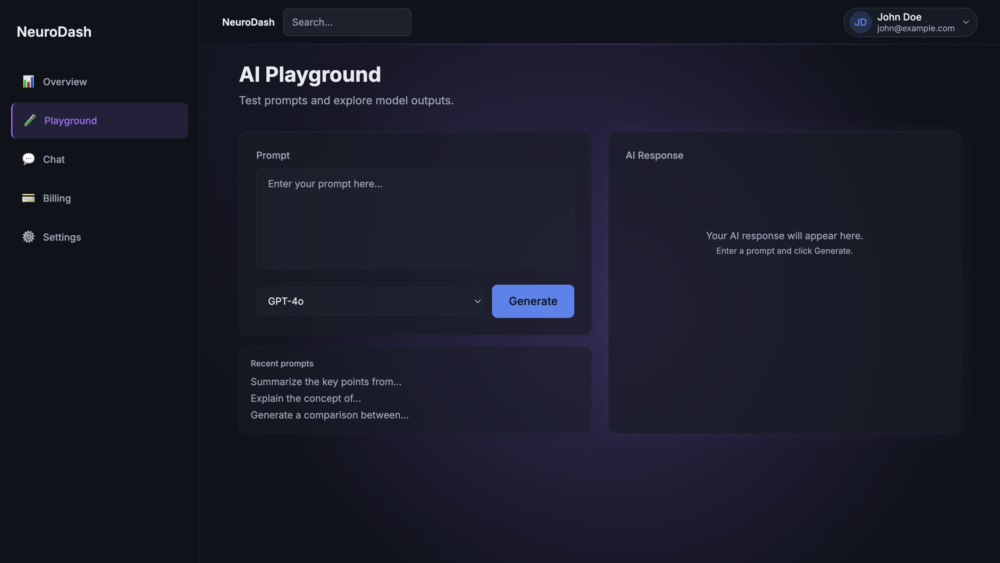
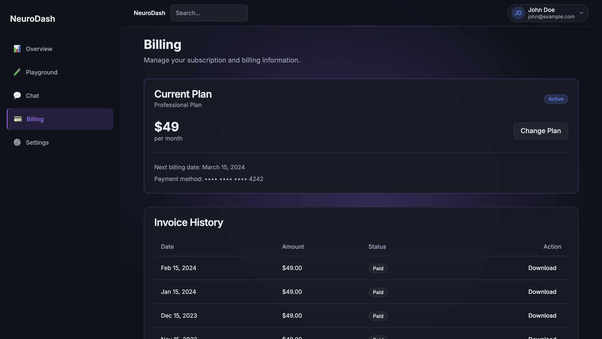

# NeuroDash – AI SaaS Starter Kit

AI SaaS Dashboard Template built with Next.js 14, TypeScript and TailwindCSS.

A modern dark-mode SaaS starter template designed for building AI products, admin dashboards, and MVP web applications quickly.

---

## Overview

NeuroDash provides a structured UI foundation for building modern AI SaaS products.

It focuses on layout architecture, dashboard composition, and reusable interface patterns so developers can accelerate MVP development without rebuilding common SaaS UI components.

---

## What is NeuroDash?

NeuroDash is a modern Next.js SaaS starter template designed specifically for AI dashboards and admin interfaces.

If you're searching for:

- Next.js SaaS starter template
- AI dashboard template
- SaaS admin dashboard built with TailwindCSS
- MVP web app UI foundation

This project provides a structured starting point using modern App Router architecture.

---

## Why this exists

Building SaaS dashboards from scratch is repetitive.

- Auth layouts  
- Sidebar structure  
- Responsive tables  
- Dark mode polish  
- Empty states  
- Basic workspace patterns  

This project provides a clean UI foundation so you can focus on product logic instead of rebuilding layout structure.

---

## What’s included

- Landing page
- Dashboard layout
- Sidebar navigation
- Sample AI workspace (UI only)
- Clean folder structure (Next.js 14 App Router)
- Fully styled dark-mode theme

---

## What’s NOT included

- No backend
- No authentication system
- No database
- No payment integration

This is a frontend starter template.

---

## Tech Stack

- Next.js 14
- TypeScript
- TailwindCSS
- App Router architecture

---

## Who this is for

- Developers building AI tools
- Indie hackers validating MVPs
- Builders who want to skip UI foundation work

---

## Screenshots

### Landing Page

### Dashboard Overview

### AI Workspace

### Meeting Transcript UI

### Billing Page

### Onboarding Flow

---

## Commercial Version

A full commercial version is available here:

👉 https://wei04.gumroad.com/l/npgru

Includes:

- Full source code
- Commercial license
- Ready-to-extend structure

---

## Is this suitable for production use?

Yes. The structure is production-ready from a UI perspective.

However, you will need to integrate:

- Authentication
- Backend APIs
- Database logic
- Payment handling (if required)

NeuroDash is designed as a frontend SaaS foundation layer.

---

## License

This repository is for preview and showcase purposes only.
Commercial usage requires purchasing the licensed version.
